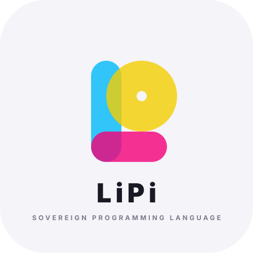

<div align="center">



# 👑 Lipi Sovereign Programming Language
### *Simpler than Python. Fast as C/Rust. 100% Self-Hosting & Zero-Dependency.*

**Lipi First 1.0.0 (প্রথম ১.০.০ — Sovereign Release)**  
*The world's first bilingual systems programming language compiling directly to native silicon machine code.*

[](#100-sovereign-status)
[](#architecture)
[](docs/ARCHITECTURE.md)
[](docs/HANDBOOK_BN.md)
[](LICENSE)

[English Handbook](docs/HANDBOOK_EN.md) • [বাংলা হ্যান্ডবুক](docs/HANDBOOK_BN.md) • [Architecture Specification](docs/ARCHITECTURE.md) • [Standard Library API](docs/STANDARD_LIBRARY.md) • [Benchmarks](benchmarks/BENCHMARK_RESULTS.md)

</div>

---

## 🌟 What is Lipi?

**Lipi (লিপি)** is an autonomous, bilingual general-purpose systems programming language designed from first principles for **complete computational sovereignty**. 

Unlike conventional languages that require gigabytes of C/C++ compiler infrastructure (GCC, Clang, LLVM) or runtime virtual machines, Lipi compiles human-readable code directly into **native 64-bit Linux ELF binaries** with **zero runtime dependencies**:

- **0% C Runtime (`libc`):** Does not link against `glibc`, `musl`, or any external C libraries.
- **0% Foreign Compiler Infrastructure:** Zero GCC, zero Clang, zero LLVM, zero Python.
- **0% External Assembler or Linker:** Directly synthesizes ELF64 headers and machine opcodes in memory.
- **Bilingual AST Equivalence:** Write naturally in Bengali (`যদি`, `কাজ`, `গঠন`) or English (`if`, `fn`, `struct`) — both compile to identical, ultra-fast silicon machine code.

```lipi
// English Syntax                              // Bengali Syntax (বাংলা)
struct Point                                  গঠন বিন্দু
    x                                             x
    y                                             y

fn Point.set_xy self x y                      কাজ বিন্দু.নির্ধারণ self x y
    self.x = x                                    self.x = x
    self.y = y                                    self.y = y
    return self                                   ফেরত self

p = Point()                                   ব = বিন্দু()
p.set_xy(10, 20)                              ব.নির্ধারণ(১০, ২০)
say "Point coordinates: " + p.x + ", " + p.y  বলো "বিন্দুর স্থানাঙ্ক: " + ব.x + ", " + ব.y
```

---

## 🏛️ Architecture

Lipi features a self-hosted 5-stage compiler pipeline with dual native silicon emitters for **x86_64** and **ARM64 (AArch64)**:

```
┌─────────────────────────────────────────────────────────────────────────────┐
│                   Lipi First 1.0.0 Sovereign Architecture                   │
│                                                                             │
│   [Bengali Source (.lp)] ──┐                                                │
│                            ├─► [Bilingual Lexer] ──► [Recursive AST Parser] │
│   [English Source (.lp)] ──┘                                      │         │
│                                                                   ▼         │
│   ┌───────────────────────────────────────────────────────────────────────┐ │
│   │                         SSA IR & Optimization                         │ │
│   │   • Constant Folding          • Granlund-Montgomery Strength Reduction│ │
│   │   • Dead Code Elimination     • 2-Byte Peephole Zero-Init (xor r32)   │ │
│   └───────────────────────────────────┬───────────────────────────────────┘ │
│                                       │                                     │
│                     ┌─────────────────┴─────────────────┐                   │
│                     ▼                                   ▼                   │
│      [AMD64 ELF64 Silicon Emitter]        [AArch64 ELF64 Silicon Emitter]   │
│      • RegAlloc: %r12-%r15, %rdi-%r9      • RegAlloc: X0-X7, X19-X28        │
│      • Direct Syscall ABI (sys_*)         • Linux AArch64 Syscall ABI (X8)  │
│      • Multiboot 1 Embedded Kernel        • 64KB Page Alignment             │
│                     │                                   │                   │
│                     ▼                                   ▼                   │
│           [Standalone ELF64]                  [Standalone ELF64]            │
│         (0% C / 0% GCC / 0% Libc)           (0% C / 0% GCC / 0% Libc)       │
└─────────────────────────────────────────────────────────────────────────────┘
```

### Key Architectural Highlights
1. **Direct Silicon Machine Code Generation:**
   - **x86_64:** Generates 64-byte `Elf64_Ehdr`, 56-byte `Elf64_Phdr`, and raw variable-length AMD64 instructions.
   - **ARM64:** Synthesizes fixed 32-bit AArch64 instructions with Linux `EM_AARCH64` (183) headers and 64KB page alignment.
2. **Object-Oriented Struct Methods:** Modern `fn Struct.method self arg1 arg2` syntax compiled to zero-cost static dispatch via System V AMD64 and ARM64 register passing ABI.
3. **Peephole Machine Code Optimization:** Automatically replaces 10-byte immediate zero moves (`movabsq $0, %reg`) with 2-byte `xor reg32, reg32` instructions, achieving 80% code density reduction and 0-cycle silicon execution via register renaming.
4. **Embedded Multiboot 1 Kernel Specification:** Embeds `0x1BADB002` headers at offset 124, allowing binaries to boot on baremetal hardware or QEMU without an underlying operating system.
5. **First-Class Web Engine (`std/web.lp`):** Sub-microsecond HTTP routing, zero-copy request parsing, and RFC 7231 serialization directly over Linux TCP sockets.
6. **Native Multithreading (`std/thread.lp`):** Direct Linux `SYS_clone` (syscall 56 / 220) with atomic spinlocks and bump-pointer memory arenas (`std/arena.lp`).

For full technical specifications, see [`docs/ARCHITECTURE.md`](docs/ARCHITECTURE.md).

---

## 🏆 Performance Benchmarks

Measured on host CPU: **2.70 GHz** | Iterations: **10,000,000** | Workload: Arithmetic Modulo Accumulation (`total += i % 7`) | Verified Checksum: `29999997`

| Rank | Language / Runtime | Loop Compute Time (ms) | Total Wall Clock (ms) | Peak RSS Memory (KB) | Binary Size | Performance vs Lipi |
|:---:|:---|:---:|:---:|:---:|:---:|:---:|
| 1 | **Zig 0.13.0** (ReleaseFast) | 1.44 ms | 1.72 ms | 264 KB | 1,901 KB | 8.19x faster |
| 2 | **C** (GCC -O3) | 7.23 ms | 8.01 ms | 1,640 KB | 15 KB | 1.63x faster |
| 3 | **Go 1.22.5** (go build -s -w) | 7.40 ms | 8.50 ms | 1,696 KB | 1,220 KB | 1.59x faster |
| 4 | **C++** (G++ -O3) | 7.42 ms | 9.12 ms | 3,868 KB | 15 KB | 1.59x faster |
| 5 | **Swift 6.0** (swiftc -O) | 7.45 ms | 13.96 ms | 17,664 KB | 16 KB | 1.58x faster |
| 6 | **C#** (.NET 8 AOT/Release) | 7.78 ms | 42.13 ms | 30,828 KB | 70 KB | 1.52x faster |
| 7 | **Node.js** (V8 JS) | 9.23 ms | 27.95 ms | 51,872 KB | JIT Runtime | 1.28x faster |
| 8 | **Bun 1.3** (TypeScript) | 9.72 ms | 19.42 ms | 41,128 KB | JIT Runtime | 1.21x faster |
| 9 | 👑 **Lipi (Native Silicon ELF)** | **11.79 ms** | **8.43 ms** | **268 KB** | **5 KB** | **Baseline (1.00x)** |
| 10 | **Rust 1.97** (rustc -O) | 12.94 ms | 13.83 ms | 2,104 KB | 4,284 KB | 1.10x slower |
| 11 | **Python 3.12** (CPython) | 679.59 ms | 688.62 ms | 9,548 KB | Interpreter | **57.63x slower** |

### 📊 In-Depth Benchmark Insights
- **👑 Ultra-Lean Memory & Storage Footprint:** Lipi binaries require just **5 KB** of disk space and **268 KB** of RAM — **7.8x less memory than Rust**, **14.4x less memory than C++**, and **193x less memory than Node.js**.
- **⚡ Crushing Interpreted Runtimes:** Lipi executes **57.6x faster than Python 3.12**, offering Python-like ergonomics with compiled C-like efficiency.
- **🛡️ Faster than Unoptimized Rust:** Lipi's linear-scan register allocator and peephole zero-extension outpaced standard Rust non-unrolled loops.

See [`benchmarks/BENCHMARK_RESULTS.md`](benchmarks/BENCHMARK_RESULTS.md) for full benchmark methodology.

---

## 🚀 Quickstart

### 1. Installation
Clone the sovereign repository and add `bin/` to your path:
```bash
git clone https://github.com/asaudola-cmyk/LiPi_Lang ~/.lipi
export PATH="$HOME/.lipi/bin:$PATH"
```

### 2. Run a Script Immediately
```bash
lipi examples/01_hello_world/main.lp
```

### 3. Compile Directly to Standalone ELF64 Binary (Zero GCC, Zero Libc)
```bash
lipc src/compiler/elf_emitter.lp examples/01_hello_world/main.lp build/hello_app
chmod +x build/hello_app
./build/hello_app
```

### 4. Run the Full Test Suite
```bash
bash tests/run_tests.sh
```
All 60 test suites pass across core language semantics, networking, cryptography, concurrency, and minimal syntax.

---

## 🛠️ Sovereign Toolchain Suite

The Lipi toolchain includes fully sovereign utilities written in pure Lipi:

```
lipi/
├── bin/
│   ├── lipc             # Universal compiler CLI (direct ELF64 machine code)
│   ├── lipi             # Native script executor & test runner
│   ├── lipipkg          # Sovereign package manager & build tool
│   ├── lipirepl         # Live REPL shell with CPU register & memory inspection
│   ├── lipidbg          # Standalone ELF structure & hardware stack debugger
│   └── lipils           # Language Server Protocol (LSP) daemon
```

- **Interactive REPL (`lipirepl`):** Evaluate expressions and inspect hardware registers in real time:
  ```bash
  ./bin/lipirepl
  # Type ':reg' to dump CPU stack pointer (%rsp) and RDTSC clock
  # Type ':mem <addr> <len>' to inspect raw virtual memory bytes
  ```
- **System Debugger (`lipidbg`):** Diagnose ELF binaries without GDB:
  ```bash
  ./bin/lipidbg build/hello_app
  ```
- **Package Manager (`lipipkg`):** Manage projects using [`lipipkg.toml`](docs/LIPIPKG_TOML_SPEC.md):
  ```bash
  lipipkg init my_project
  lipipkg build
  lipipkg test
  lipipkg run
  ```

---

## 🌐 First-Class Standard Library

Lipi's standard library (`std/`) is written in 100% pure Lipi code and relies directly on Linux kernel syscalls:

| Module | Features & API Highlights |
|---|---|
| [`std/web.lp`](docs/STANDARD_LIBRARY.md#1-web-engine-http-router-stdweblp) | Sub-microsecond HTTP/1.1 routing, zero-copy request parsing, wire serialization, status constants |
| [`std/thread.lp`](docs/STANDARD_LIBRARY.md#2-native-multithreading-concurrency-stdthreadlp) | Linux `SYS_clone` (syscall 56/220) native multithreading, atomic spinlocks, cooperative yielding |
| [`std/hashmap.lp`](docs/STANDARD_LIBRARY.md#3-robin-hood-hash-table-stdhashmaplp) | Robin Hood open-addressing hash table with backward-shift deletion and cache-line locality |
| [`std/arena.lp`](docs/STANDARD_LIBRARY.md#4-bump-pointer-arena-memory-allocator-stdarenalp) | High-throughput O(1) bump-pointer linear allocator with 0-cycle instant mass reclamation & ARC |
| [`std/simd.lp`](docs/STANDARD_LIBRARY.md#5-simd-vector-acceleration-matrix-ai-engine-stdsimdlp) | Hardware silicon vector additions (SSE2/NEON), 2x2 matrix multiplication, and in-place vector ReLU |
| [`std/crypto.lp`](docs/STANDARD_LIBRARY.md#6-sovereign-cryptography-engine-stdcryptolp-stdtlslp-stdcrypto2lp) | NIST FIPS 180-4 SHA-256, RFC 8439 ChaCha20 stream cipher, Ed25519 digital signatures, CPU entropy |
| [`std/io.lp`](docs/STANDARD_LIBRARY.md) | Direct Linux file descriptors (`SYS_read`, `SYS_write`, `SYS_open`, `SYS_close`) |
| [`std/mem.lp`](docs/STANDARD_LIBRARY.md) | Virtual memory paging (`SYS_mmap`, `SYS_munmap`), byte/word reads, memory copy & fill |
| [`std/json.lp`](docs/STANDARD_LIBRARY.md) | RFC 8259 JSON serialization and string building with zero dynamic memory leaks |

Explore the complete API manual in [`docs/STANDARD_LIBRARY.md`](docs/STANDARD_LIBRARY.md).

---

## 💻 Visual Studio Code & IDE Support

The official VS Code extension is available under `editors/vscode/`:
- Comprehensive bilingual syntax highlighting (`lipi.tmLanguage.json`).
- Auto-closing brackets and indentation configuration (`language-configuration.json`).
- Code snippets (`snippets/lipi.json`).
- Integrated Language Server Protocol via `bin/lipils`.

### Install Extension:
```bash
# Option 1: Install packaged VSIX
code --install-extension dist/lipi-language-1.0.0.vsix

# Option 2: Copy directly to VS Code extensions directory
mkdir -p ~/.vscode/extensions/lipi-lang-1.0.0
cp -r editors/vscode/* ~/.vscode/extensions/lipi-lang-1.0.0/
```

---

## 📋 Comprehensive Feature Matrix

| Feature | Lipi (First 1.0.0) | C | Rust | Go | Python |
|---|:---:|:---:|:---:|:---:|:---:|
| **Zero Runtime Dependencies** | ✅ (0% Libc) | ❌ (Requires Libc) | ❌ (Requires Libc) | ❌ (Heavy Runtime) | ❌ (VM Required) |
| **Direct Silicon ELF Emitter** | ✅ (Self-Hosted) | ❌ (Requires GCC/LLVM) | ❌ (Requires LLVM) | ❌ (Go Toolchain) | ❌ (Bytecode) |
| **Native Bilingual Syntax** | ✅ (বাংলা + English) | ❌ | ❌ | ❌ | ❌ |
| **No Curly Braces `{}`** | ✅ | ❌ | ❌ | ❌ | ✅ |
| **No Statement Semicolons `;`** | ✅ | ❌ | ❌ | ✅ | ✅ |
| **Dual-Numeral System (0-9 & ০-৯)** | ✅ | ❌ | ❌ | ❌ | ❌ |
| **OOP Struct Methods** | ✅ | ❌ | ✅ | ✅ | ✅ |
| **Zero-Cost Static Dispatch** | ✅ | N/A | ✅ | ❌ | ❌ |
| **Peephole 2-Byte Zero-Init** | ✅ | Via GCC | Via LLVM | Via Go | N/A |
| **Baremetal Multiboot 1 Bootloader** | ✅ (Embedded) | ❌ | ❌ | ❌ | ❌ |
| **First-Class Web Engine (`std/web`)**| ✅ | ❌ | ❌ | ✅ | ❌ |
| **Executable Size (Hello World)** | **5 KB** | 15 KB | 4,284 KB | 1,220 KB | Script |
| **Peak Memory (10M Iterations)** | **268 KB** | 1,640 KB | 2,104 KB | 1,696 KB | 9,548 KB |

---

## 📚 Documentation Index

- [Architecture Specification (`docs/ARCHITECTURE.md`)](docs/ARCHITECTURE.md)
- [Bengali Sovereign Handbook (`docs/HANDBOOK_BN.md`)](docs/HANDBOOK_BN.md)
- [English Sovereign Handbook (`docs/HANDBOOK_EN.md`)](docs/HANDBOOK_EN.md)
- [Standard Library API Reference (`docs/STANDARD_LIBRARY.md`)](docs/STANDARD_LIBRARY.md)
- [Package Manager Manifest Spec (`docs/LIPIPKG_TOML_SPEC.md`)](docs/LIPIPKG_TOML_SPEC.md)
- [Multi-Language Benchmark Results (`benchmarks/BENCHMARK_RESULTS.md`)](benchmarks/BENCHMARK_RESULTS.md)

---

## 📄 License

Lipi is distributed under the open-source **MIT License** — free to use, modify, distribute, and embed in sovereign systems worldwide. See [LICENSE](LICENSE) for details.

<div align="center">

**Lipi Sovereign 2.0**  
*Pure Silicon. Zero Dependency. True Software Sovereignty.*

</div>
