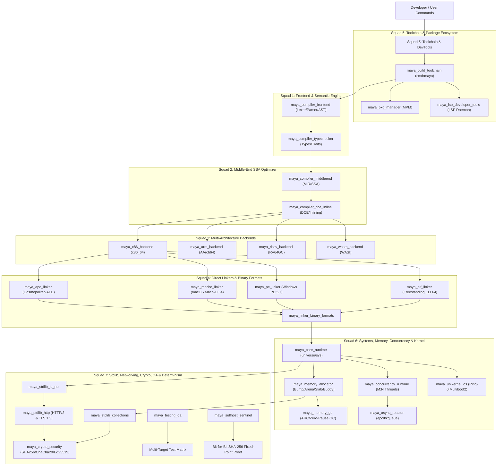

# 🏛️ The Maya Supreme Council of 28 Autonomous Subagents (Sovereignty 2.0)

> **Sovereignty Doctrine:** Maya maintains **0.0000001% Zero External Reliance**. Maya takes zero help from C, C++, GCC, Clang, LLVM, Python, libc, glibc, musl, or external linkers. Every layer from the bare-metal CPU silicon to the highest-level web server and package manager is engineered, compiled, and maintained in 100% pure Maya by a dedicated council of 28 specialized subagents.

---

## 📋 Full Roster of the 28 Autonomous Subagents

| # | Agent Identifier | Specialized Role | Target Domain | Core Focus & Responsibilities |
|---|---|---|---|---|
| 1 | `maya_compiler_frontend` | Frontend Compiler Architect | `compiler/frontend` | Pure Maya Lexer, Tokenizer, AST/CST, Macros, Source Spans |
| 2 | `maya_compiler_typechecker` | Type Checker & Semantics Lead | `compiler/frontend` | Hindley-Milner Inference, Struct Typing, Traits/Interfaces, Compile-Time Safety |
| 3 | `maya_compiler_middleend` | MIR & SSA Optimization Engineer | `compiler/middleend` | Maya IR (MIR), SSA Construction, CFG, Dominance Frontiers |
| 4 | `maya_compiler_dce_inline` | DCE & Inlining Specialist | `compiler/middleend` | Dead Code Elimination, Function Inliner, Devirtualization, Constant Folding |
| 5 | `maya_x86_backend` | x86_64 Machine Code Specialist | `compiler/backend/x86_64` | Native x86_64 Machine Code, System V & MS x64 ABIs, RegAlloc, AVX2 SIMD |
| 6 | `maya_arm_backend` | ARM64 / AArch64 Backend Engineer | `compiler/backend/arm64` | AArch64 Fixed-Width Encodings, AAPCS64 ABI, Apple Silicon & Linux ARM64 |
| 7 | `maya_riscv_backend` | RISC-V 64 Backend Specialist | `compiler/backend/riscv64` | RV64GC (IMAFDC) Encodings, Standard ABI, RVC Compressed Insts, Atomics |
| 8 | `maya_wasm_backend` | WebAssembly (WASM/WASI) Architect | `compiler/backend/wasm` | Binary WASM Bytecode, WASI Preview 1 Direct Emission, Zero Emscripten |
| 9 | `maya_elf_linker` | Freestanding Linux ELF64 Linker | `compiler/backend/formats` | Pure Maya ELF64 Direct Serializer, PT_LOAD Segments, Zero GNU ld |
| 10 | `maya_pe_linker` | Direct Windows PE32+ Linker | `compiler/backend/formats` | Pure Maya PE32+ (.exe) Serializer, DOS Stub, COFF, Optional Header, Imports |
| 11 | `maya_macho_linker` | Direct macOS Mach-O 64 Linker | `compiler/backend/formats` | Pure Maya Mach-O 64 Serializer, LC_SEGMENT_64, LC_MAIN, Zero Xcode |
| 12 | `maya_ape_linker` | Cosmopolitan APE Fat Binary Lead | `compiler/backend/formats` | Polyglot Shell Trampoline, Multi-OS Execution (Linux, Windows, macOS) |
| 13 | `maya_linker_binary_formats` | Binary Formats Orchestrator | `compiler/backend/formats` | Multi-Target Format Routing, Symbol Resolution, Binary Determinism |
| 14 | `maya_core_runtime` | Freestanding Core Runtime Engineer | `universe/sys` | Zero-Libc Raw Direct Syscalls, `_start` Entry Point, Process Lifecycle |
| 15 | `maya_memory_allocator` | Low-Level Memory Allocator | `universe/memory` | Raw `sys_mmap` Allocators: Bump, Arena, Slab, Buddy Page Pools |
| 16 | `maya_memory_gc` | Memory Management & GC Engine | `universe/memory` | Automatic Reference Counting (ARC), Cycle Collector, Zero-Pause GC |
| 17 | `maya_concurrency_runtime` | M:N Green Threads & Async Lead | `universe/concurrency` | Maya Fibers / Goroutines, User-Space Context Switching, Work-Stealing |
| 18 | `maya_async_reactor` | Asynchronous I/O Reactor Lead | `universe/concurrency` | Linux Raw `epoll`/`io_uring`, macOS Raw `kqueue`, Zero libuv Dependency |
| 19 | `maya_stdlib_collections` | Standard Collections Architect | `universe/collections` | SwissTable HashMap, Vec, RingBuffer, BTreeMap, UTF-8 String & Slices |
| 20 | `maya_stdlib_io_net` | Sovereign I/O & Sockets Lead | `universe/net` | Buffered I/O Streams, Raw IPv4/IPv6 TCP/UDP, Pure RFC 1035 DNS Resolver |
| 21 | `maya_stdlib_http` | Sovereign HTTP & TLS Protocol Lead| `universe/net/http` | Pure Maya HTTP/1.1 & HTTP/2, Pure TLS 1.3 Handshake, Zero OpenSSL |
| 22 | `maya_crypto_security` | Cryptography & Security Lead | `universe/crypto` | Pure SHA-256, SHA-512, ChaCha20-Poly1305, Ed25519, CSPRNG, Constant-Time |
| 23 | `maya_pkg_manager` | Decentralized Package Manager | `packages/mpm` | MPM (`maya pkg`), P2P Content-Addressed Storage, Lockfiles, Semver |
| 24 | `maya_build_toolchain` | CLI Toolchain & Driver Architect | `cmd/maya` | Master CLI Driver: `build`, `run`, `test`, `bench`, `doc`, `fmt`, `pkg` |
| 25 | `maya_unikernel_os` | Bare-Metal Ring-0 OS Architect | `universe/os` | Ring-0 Multiboot2 Cloud Unikernel, 64-bit Long Mode, Sub-5ms MicroVM Boot |
| 26 | `maya_lsp_developer_tools` | LSP Server & DevTools Lead | `editors/lsp` | JSON-RPC 2.0 LSP Daemon, Autocomplete, Hover Docs, Canonical Formatter |
| 27 | `maya_testing_qa` | Ecosystem QA & Test Lead | `tests` | Multi-Target Test Matrix, Regression Test Runner, Process Isolation, Fuzzing |
| 28 | `maya_selfhost_sentinel` | Triple-Stage Self-Hosting Sentinel | `tools/selfhost` | Stage 1 -> 2 -> 3 Bit-for-Bit Deterministic SHA-256 Fixed-Point Proof |

---

## 🛡️ 7 Specialized Autonomous Squads

