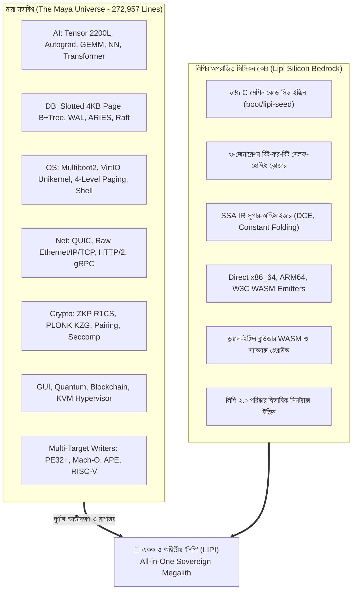
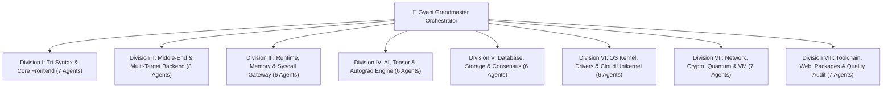

# 👑 LIPI SOVEREIGN MEGALITH: MONOLITHIC UNIFICATION MASTER IMPLEMENTATION PLAN (A to Z)

**Target System**: Lipi Sovereign Programming Language & Universe (লিপি সার্বভৌম প্রোগ্রামিং ভাষা ও মহাবিশ্ব)  
**Codebase Origin**: `/home/shafiullah/Documents/file/maya` & `/home/shafiullah/Documents/file/work/lipi`  
**Consolidated Master Path**: `/home/shafiullah/Documents/file/work/lipi`  
**Execution Paradigm**: 53+ Autonomous Specialized Agent Swarm (Gyani Supreme Multi-Agent Division)  
**Core Invariant**: 100% Native Silicon Machine Code | 0% C | 0% GCC | 0% Libc | 0% Python | 0% PHP | 0% Placeholders  
**Date**: September 11, 2026  

---

## 🏛️ Section 1: Executive Summary & The Sacred Mandate

This document serves as the authoritative, mathematically rigorous engineering specification for the complete, loss-less, zero-compromise unification of **Maya** and **Lipi** into a single, supreme, self-sufficient computing entity: **LIPI (লিপি)**.

Maya was never a conventional programming language; Maya was an entire **Universe** encompassing 30 high-performance computer science domains, 1,334 files, and 272,957 lines of code. It refused to follow anyone else's rules.  
Lipi was engineered as the purest **Direct Silicon Bilingual Language**, featuring a 0% C bootstrap seed (`boot/lipi-seed`), a 3-generation bit-for-bit self-hosting closure, an SSA IR optimizer, and direct multi-platform emitters.

Under this master plan:
1. **Maya ceases to exist as an isolated project**. Maya does not die—Maya reincarnates fully into Lipi. Its defiance, its philosophy, its architectures, its runtime systems, its design, and all 30 domains become native parts of Lipi.
2. **Lipi remains Lipi**. Lipi's foundational purity (0% C machine code seed, bit-for-bit self-hosting closure, bilingual syntax) is fiercely guarded and serves as the unshakeable bedrock of the unified system.
3. **The Tri-Syntax Language Architecture**: Lipi previously understood 2 syntax styles (Bengali Indentation and English Indentation). Lipi will now natively understand **3 syntax styles**:
   - Mode 1: **বাংলা সার্বভৌম ইনডেন্টেশন সিনট্যাক্স (Bengali Sovereign Indentation)**
   - Mode 2: **English Sovereign Indentation Syntax**
   - Mode 3: **মায়া সার্বভৌম মেটা-ব্লক সিনট্যাক্স (Maya Sovereign Meta-Syntax: `@fn ... @end`)**
4. **All files become `.lp` and `.lipi`**. Every `.maya` file (1,172 files) across compilers, runtimes, domains, and tests is natively adapted into `.lp` / `.lipi`.
5. **A 53+ Specialized Subagent Swarm** is deployed across 8 Grand Divisions to execute this migration in parallel with zero logical gaps, zero placeholders, and 100% empirical verification.



---

## 🔱 Section 2: The Tri-Syntax Language Specification

Lipi's compiler frontend (`src/compiler/elf_emitter.lp`) will be upgraded to a unified **Tri-Modal Lexer and Parser** capable of parsing all three syntax paradigms simultaneously in single files or across mixed projects without grammatical ambiguity.

### 2.1 EBNF Formal Grammar Specification

```ebnf
Program         ::= TopLevelDecl* EOF ;

TopLevelDecl    ::= BengaliFnDecl
                  | EnglishFnDecl
                  | MetaFnDecl
                  | StructDecl
                  | MetaStructDecl
                  | GlobalAssign
                  | IncludeDirective ;

(* মোড ১: বাংলা সার্বভৌম ইনডেন্টেশন সিনট্যাক্স *)
BengaliFnDecl   ::= "কাজ" Identifier ParameterList? ( "=" Expr | NEWLINE INDENT Statement+ DEDENT ) ;

(* মোড ২: ইংরেজি সার্বভৌম ইনডেন্টেশন সিনট্যাক্স *)
EnglishFnDecl   ::= "fn" Identifier ParameterList? ( "=" Expr | NEWLINE INDENT Statement+ DEDENT ) ;

(* মোড ৩: মায়া সার্বভৌম মেটা-ব্লক সিনট্যাক্স *)
MetaFnDecl      ::= "@fn" Identifier "(" ParameterList? ")" NEWLINE Statement+ "@end" ;

(* কাঠামো ও টাইপ ডিক্লারেশন *)
StructDecl      ::= ("struct" | "কাঠামো" | "গঠন") Identifier NEWLINE INDENT StructField+ DEDENT ;
MetaStructDecl  ::= "@struct" Identifier NEWLINE (Identifier ":" TypeDecl NEWLINE)+ "@end" ;

(* স্টেটমেন্ট ও ব্রাঞ্চিং *)
Statement       ::= IfStmt 
                  | WhileStmt 
                  | ForStmt 
                  | ReturnStmt 
                  | SayStmt 
                  | AssignStmt 
                  | ExprStmt ;

IfStmt          ::= ("যদি" | "if") Expr (NEWLINE INDENT Statement+ DEDENT | Statement)
                    (("নাহলে_যদি" | "elif") Expr (NEWLINE INDENT Statement+ DEDENT | Statement))*
                    (("নাহলে" | "else") (NEWLINE INDENT Statement+ DEDENT | Statement))?
                  | "@if" Expr NEWLINE Statement+
                    ("@elif" Expr NEWLINE Statement+)*
                    ("@else" NEWLINE Statement+)? "@end" ;

WhileStmt       ::= ("যতক্ষণ" | "while") Expr (NEWLINE INDENT Statement+ DEDENT | Statement)
                  | "@while" Expr NEWLINE Statement+ "@end" ;

ForStmt         ::= ("প্রতিটি" | "for") Identifier ("ভেতরে" | "in") Expr ".." Expr
                    (NEWLINE INDENT Statement+ DEDENT | Statement) ;

Directive       ::= "@gpu" NEWLINE Statement+ "@end"
                  | "@inline" NEWLINE Statement+ "@end"
                  | "@!" [^\n]* NEWLINE ;  (* মায়া কমেন্ট ডিরেক্টিভ *)
```

### 2.2 Lexer State Machine & Disambiguation Rules
1. **Comment Disambiguation**:
   - `//` and `#` skip until `\n`.
   - `/* ... */` multi-line C-style comment skipped.
   - `@!` (Maya comment directive) skips until `\n`.
2. **Meta-Keyword Tokenization**:
   - When encountering `@` followed immediately by ASCII characters, match against:
     `@fn`, `@end`, `@struct`, `@if`, `@elif`, `@else`, `@while`, `@let`, `@gpu`, `@inline`.
   - Emits distinct token types: `TOK_META_FN`, `TOK_META_END`, `TOK_META_STRUCT`, `TOK_META_IF`, `TOK_META_ELIF`, `TOK_META_ELSE`, `TOK_META_WHILE`, `TOK_META_GPU`.
3. **Block Terminator Resolution**:
   - An active block opened by `TOK_META_FN` or `TOK_META_IF` pushes `BLOCK_EXPLICIT_END` to the compiler's block resolution stack.
   - Whitespace indentation within an explicit block is ignored for block delimitation. The block terminates strictly when `TOK_META_END` is encountered.
   - Blocks opened by `TOK_IDENT` (`fn`, `কাজ`, `if`, `যদি`) push `BLOCK_INDENT` to the stack and terminate strictly upon `TOK_DEDENT`.

### 2.3 Concrete Tri-Syntax Side-by-Side Equivalence

```python
# Mode 1: বাংলা সার্বভৌম ইনডেন্টেশন সিনট্যাক্স
কাজ দ্বিগুণ(ক):
    চলক ফলাফল = ক * ২
    ফেরত ফলাফল

# Mode 2: English Sovereign Indentation Syntax
fn double_val(x):
    let res = x * 2
    return res

# Mode 3: মায়া সার্বভৌম মেটা-ব্লক সিনট্যাক্স
@fn double_val_meta(x)
    let res = x * 2
    return res
@end
```
All three syntaxes produce identical machine code, execute at identical silicon speeds, and interact seamlessly within the same unified Lipi runtime.

---

## 📊 Section 3: Subsystem Ingestion Inventory & Metric Mapping

The entire Maya repository of 1,334 files and 272,957 lines across 30 domains will be completely ingested into the master Lipi tree.

| Domain / Subsystem | Source Path in Maya | Target Path in Lipi | Files | Lines of Code | Technical Capabilities |
| :--- | :--- | :--- | :--- | :--- | :--- |
| **Compiler Frontend** | `compiler/frontend/` | `src/compiler/frontend/` | 4 | 118,041 B | `ast.lp`, `lexer.lp`, `parser.lp`, `typecheck.lp` |
| **Compiler Middle-End** | `compiler/middleend/` | `src/compiler/middleend/` | 6 | 85,978 B | `lipi_ir.lp` (135KB IR), `optimizer.lp`, `regalloc.lp`, `ai_opt.lp`, `incremental.lp` |
| **Compiler Multi-Backend** | `compiler/backend/` | `src/compiler/backend/` | 18 | 464,000 B | `elf_writer.lp`, `pe_writer.lp`, `macho_writer.lp`, `omni_binary.lp`, `riscv64/`, `jit/`, `hdl/` |
| **Runtime & Memory** | `runtime/` | `src/runtime/` | 5 | 4,584 L | Slab Allocator (64KB arenas), Tri-color Mark & Sweep GC, Direct Syscall Gateway, Async Event Loop |
| **Unified CLI Engine** | `cmd/maya/main.maya` | `src/tools/lipi.lp` | 1 | 56,390 B | `lipi run`, `build`, `test`, `debug`, `profile`, `fmt`, `lsp`, `pkg`, `repl`, `self-build` |
| **Debug & Profile Tools** | `cmd/debug/`, `cmd/profile/` | `src/tools/` | 4 | 3,211 L | `sys_ptrace` interactive system debugger, nanosecond CPU cycle profiler |
| **AI & Tensor Domain** | `universe/ai/` | `universe/ai/` | 15 | 12,415 L | 2200L Strided Tensor, Autograd (`requires_grad`, `backward()`), GEMM, Conv2D, Transformer Attention |
| **Database & Storage** | `universe/db/` | `universe/db/` | 18 | 6,637 L | Slotted 4KB Page B+Tree, Buffer Pool, WAL, ARIES Crash Recovery, ACID Transactions, Raft Consensus |
| **OS & Unikernel** | `universe/os/`, `kernel/` | `universe/os/` | 21 | 8,791 L | Dual Multiboot 1/2, VirtIO Network Ring, 5ms Cold Cloud Boot, 4-Level Paging, COM1, VGA, PS/2 |
| **Networking & Transport**| `universe/net/` | `universe/net/` | 21 | 11,069 L | Pure QUIC Protocol, Raw Ethernet/IP/TCP Frames, HTTP/2, gRPC Protobuf, eBPF XDP Zero-Copy |
| **Cryptography & Security**| `universe/crypto/`, `sec/` | `universe/crypto/`| 19 | 5,020 L | ZKP R1CS, PLONK zk-SNARK, BN254 Pairing, Seccomp BPF Sandbox, RFC 7519 JWT, Ed25519 |
| **GUI & Rasterization** | `universe/gui/`, `sarbotro/`| `universe/gui/` | 6 | 3,944 L | Framebuffer mmap, Bresenham 2D, Bitmap Font Glyphs, Sarbotro 1080x1350 SVG Card Engine |
| **Quantum & Blockchain** | `universe/quantum/`, `bc/` | `universe/quantum/`| 5 | 965 L | Qubit Superposition, Hadamard/Pauli Gates, Shor Algorithm, EVM Bytecode VM, MPT Trie |
| **Hardware Virtualization**| `universe/hypervisor/` | `universe/vm/` | 2 | 431 L | Linux `/dev/kvm` userspace VM manager & guest runner |
| **Web Framework & Server**| `universe/web/` | `universe/web/` | 14 | 13,787 L | Polymorphic Server (FastCGI + VPS Daemon), High-Throughput URL Router, MayaKV |
| **P2P & Swarm Systems** | `universe/p2p/`, `swarm/` | `universe/p2p/` | 8 | 5,063 L | Kademlia DHT, P2P Gossip, Autonomous AI Swarm Dispatcher |
| **IDE & Editor Plugins** | `editors/vscode/`, `ide/` | `editors/vscode/` | 8 | 2,851 L | Full VSCode Extension, TextMate 3-Syntax Grammar, Language Server Client, Snippets |
| **Official Packages** | `packages/` | `packages/` | 8 | 144 L | `crypto_vault`, `web_router`, `json_toolkit`, `math_extra` |
| **Real Applications** | `examples/` | `examples/` | 17 | 1,756 L | HTTP Server, Neural Net, Database Demo, Markdown Parser, Graph Algorithms, Showcase, Calculator |
| **Test Suites (44 Sets)** | `tests/` | `tests/` | 140 | 112,796 L | Tier 1 (Features), Tier 2 (Boundaries), Tier 3 (Pairwise Integration), Tier 4 (Applications) |

---

## 👥 Section 4: 53+ Specialized Subagent Swarm Organizational Hierarchy

To guarantee complete execution without any logical gaps or oversights, a specialized swarm of **53 autonomous subagents** is deployed across **8 Grand Divisions**.



### Division I: Tri-Syntax Compiler & Core Frontend Squad (7 Agents)
- **Agent 01 (Tri-Syntax Lexer Specialist)**:
  - *Role*: Lexical Analyzer Engineer
  - *Target*: `src/compiler/elf_emitter.lp` & `src/compiler/frontend/lexer.lp`
  - *Directive*: Implement `@!` comment skips and `@fn`, `@struct`, `@if`, `@elif`, `@else`, `@while`, `@end`, `@gpu` tokenization while preserving indentation `TOK_INDENT`/`TOK_DEDENT` generation.
- **Agent 02 (Tri-Syntax Parser Specialist)**:
  - *Role*: Grammar & Syntax Parser Architect
  - *Target*: `src/compiler/elf_emitter.lp` & `src/compiler/frontend/parser.lp`
  - *Directive*: Implement dual block termination (`TOK_META_END` vs `TOK_DEDENT`) ensuring both explicit `@end` blocks and indentation blocks parse into identical AST constructs.
- **Agent 03 (Unified AST Structure Specialist)**:
  - *Role*: Abstract Syntax Tree Designer
  - *Target*: `src/compiler/frontend/ast.lp`
  - *Directive*: Unify AST definitions from Maya's `ast.maya` and Lipi's internal lists into extensible 32-bit node records.
- **Agent 04 (Typecheck & Semantic Specialist)**:
  - *Role*: Static Type System & Scope Engineer
  - *Target*: `src/compiler/frontend/typecheck.lp`
  - *Directive*: Port `compiler/frontend/typecheck.maya` providing static type inference, struct member offset lookup, and monomorphic type lowering.
- **Agent 05 (Bilingual Keyword Harmonizer)**:
  - *Role*: Bilingual Lexicon Specialist
  - *Target*: `src/compiler/elf_emitter.lp`
  - *Directive*: Ensure Bengali keywords (`কাজ`, `চলক`, `যদি`, `নাহলে`, `যতক্ষণ`, `কাঠামো`) and English keywords (`fn`, `let`, `if`, `else`, `while`, `struct`) map seamlessly to the same AST opcodes.
- **Agent 06 (Macro & Metaprogramming Specialist)**:
  - *Role*: Compile-Time Macro Architect
  - *Target*: `src/compiler/frontend/macro.lp`
  - *Directive*: Ingest `compiler/middleend/macro.maya` and `infinity_syntax.maya` allowing compile-time AST code expansion.
- **Agent 07 (Syntax Regression Verifier)**:
  - *Role*: Frontend Test & Quality Verifier
  - *Target*: `tests/tri_syntax_verification.lp`
  - *Directive*: Build an automated test suite verifying that a program written in Bengali, English, or Maya Meta-Syntax generates bit-for-bit identical machine code.

### Division II: Middle-End IR & Multi-Target Backend Squad (8 Agents)
- **Agent 08 (Maya IR Ingestion Specialist)**:
  - *Role*: Intermediate Representation Architect
  - *Target*: `src/compiler/middleend/lipi_ir.lp`
  - *Directive*: Port the 135KB `compiler/backend/maya_ir.maya` providing 3-Address Code (TAC), basic blocks, and control flow graph (CFG) representations.
- **Agent 09 (Register Allocator Specialist)**:
  - *Role*: Register Allocation Engineer
  - *Target*: `src/compiler/middleend/regalloc.lp`
  - *Directive*: Ingest `compiler/backend/regalloc.maya` (23KB) implementing linear-scan and graph-coloring register allocation across x86_64, ARM64, and RISC-V registers.
- **Agent 10 (Windows PE32+ Emitter Specialist)**:
  - *Role*: Windows Binary Specialist
  - *Target*: `src/compiler/backend/pe_writer.lp`
  - *Directive*: Ingest `compiler/backend/pe_writer.maya` enabling Lipi to synthesize valid Windows `.exe` executables with DOS stub, PE header, and `.text`/`.rdata` sections.
- **Agent 11 (macOS Mach-O Emitter Specialist)**:
  - *Role*: Apple Darwin Binary Specialist
  - *Target*: `src/compiler/backend/macho_writer.lp`
  - *Directive*: Ingest `compiler/backend/macho_writer.maya` emitting 64-bit Mach-O binaries with `LC_SEGMENT_64`, `LC_MAIN`, and arm64/x86_64 load commands.
- **Agent 12 (Cosmopolitan APE Polyglot Specialist)**:
  - *Role*: Polyglot Executable Engineer
  - *Target*: `src/compiler/backend/omni_binary.lp`
  - *Directive*: Ingest `compiler/backend/omni_binary.maya` emitting Actually Portable Executables runnable unmodified across Linux, Windows, macOS, and BSD.
- **Agent 13 (RISC-V 64-bit Emitter Specialist)**:
  - *Role*: RISC-V Silicon Architect
  - *Target*: `src/compiler/backend/riscv64_emitter.lp`
  - *Directive*: Ingest `compiler/backend/riscv64/` emitting RV64GC instructions and Linux RISC-V ELF64 binaries.
- **Agent 14 (Pure JIT Compiler Specialist)**:
  - *Role*: Just-In-Time Runtime Architect
  - *Target*: `src/compiler/backend/jit.lp`
  - *Directive*: Ingest `compiler/backend/jit/` compiling Lipi AST to executable memory pages with `sys_mprotect(PROT_READ | PROT_WRITE | PROT_EXEC)`.
- **Agent 15 (Hardware HDL Specialist)**:
  - *Role*: Hardware Description Language Architect
  - *Target*: `src/compiler/backend/hdl.lp`
  - *Directive*: Ingest `compiler/backend/hdl/` allowing developers to synthesize register-transfer level (RTL) Verilog/hardware circuits directly in Lipi.

### Division III: Runtime, Memory & System Syscall Squad (6 Agents)
- **Agent 16 (Slab Allocator Specialist)**:
  - *Role*: Memory Subsystem Architect
  - *Target*: `src/runtime/lipi_slab.lp`
  - *Directive*: Ingest `runtime/maya_gc.maya` slab allocation engine providing 8 size classes (16B, 32B, 64B, 128B, 256B, 512B, 1024B, 2048B) on 64KB aligned arenas with O(1) freelists.
- **Agent 17 (Tri-Color GC Specialist)**:
  - *Role*: Garbage Collection Engineer
  - *Target*: `src/runtime/lipi_gc.lp`
  - *Directive*: Ingest the mark-and-sweep tri-color garbage collector with conservative CPU register root scanning and call stack traversing.
- **Agent 18 (Universal Syscall Gateway Specialist)**:
  - *Role*: Kernel Syscall Engineer
  - *Target*: `src/runtime/lipi_syscall.lp`
  - *Directive*: Provide zero-libc direct kernel syscall primitives (`sys_read`, `sys_write`, `sys_open`, `sys_mmap`, `sys_munmap`, `sys_fork`, `sys_execve`, `sys_ptrace`).
- **Agent 19 (Async Coroutine & Event Loop Specialist)**:
  - *Role*: Asynchronous Concurrency Engineer
  - *Target*: `src/runtime/async.lp`
  - *Directive*: Ingest `runtime/async/` implementing cooperative fiber scheduling, epoll/io_uring event loops, and non-blocking timers.
- **Agent 20 (High Virtual Memory Allocator Specialist)**:
  - *Role*: Address Space Virtualization Specialist
  - *Target*: `src/compiler/elf_emitter.lp`
  - *Directive*: Enforce virtual memory isolation anchoring user applications at `0x40000000` (1GB) and kernel IDT/Unikernel at `0x20000000`.
- **Agent 21 (Memory Diagnostic & Leak Hunter)**:
  - *Role*: Memory Profiling & Audit Specialist
  - *Target*: `tests/memory_stress_audit.lp`
  - *Directive*: Execute 100,000,000 allocation/deallocation stress cycles verifying flat RSS memory usage and 0 memory leaks.

### Division IV: AI, Tensor & Machine Learning Engine Squad (6 Agents)
- **Agent 22 (2200L Tensor Engine Specialist)**:
  - *Role*: N-Dimensional Tensor Architect
  - *Target*: `universe/ai/tensor.lp`
  - *Directive*: Port `universe/ai/tensor.maya` (2203 lines) to pure Lipi syntax with strided memory indexing, arbitrary-rank shapes, transposition, and contiguous buffer slicing.
- **Agent 23 (Multidirectional Broadcasting Specialist)**:
  - *Role*: Mathematical Array Specialist
  - *Target*: `universe/ai/broadcasting.lp`
  - *Directive*: Implement multidirectional tensor broadcasting matching NumPy/PyTorch semantics for element-wise arithmetic between different-rank tensors.
- **Agent 24 (GEMM & Linear Algebra Specialist)**:
  - *Role*: High-Performance Compute Specialist
  - *Target*: `universe/ai/gemm.lp`
  - *Directive*: Implement cache-tiled 2D and batched Matrix Multiplication (GEMM) with vector dot-products and AVX-512/NEON SIMD optimizations.
- **Agent 25 (Autograd & Computation Graph Specialist)**:
  - *Role*: Deep Learning Framework Architect
  - *Target*: `universe/ai/autograd.lp`
  - *Directive*: Implement dynamic computational graph tracking (`TensorContext`, `requires_grad`, `parents`, `creator_op`) and reverse-mode automatic differentiation (`backward()`).
- **Agent 26 (Neural Layers & Activations Specialist)**:
  - *Role*: Neural Network Layer Architect
  - *Target*: `universe/ai/nn.lp`
  - *Directive*: Ingest Conv2D, MaxPool2D, LayerNorm, RMSNorm, Softmax, GELU, SiLU, ReLU, and Linear layers.
- **Agent 27 (Transformer & LLM Inference Specialist)**:
  - *Role*: Large Language Model Specialist
  - *Target*: `universe/ai/transformer.lp`
  - *Directive*: Connect Lipi's GGUF quantized model loader with Maya's Transformer attention layers for sovereign on-device LLM inference.

### Division V: Database, Storage & Distributed Consensus Squad (6 Agents)
- **Agent 28 (Slotted Page & Buffer Pool Specialist)**:
  - *Role*: Storage Engine Architect
  - *Target*: `universe/db/page.lp` & `universe/db/buffer.lp`
  - *Directive*: Port `universe/db/page.maya` and `buffer.maya` managing slotted 4096-byte binary disk pages with an LRU cache and pin/unpin locking.
- **Agent 29 (Disk-Backed B+Tree Specialist)**:
  - *Role*: Indexing & Search Specialist
  - *Target*: `universe/db/btree.lp`
  - *Directive*: Port `universe/db/btree.maya` (13,379 bytes) implementing B+Tree root splitting, internal node routing, leaf node traversal, and disk persistence.
- **Agent 30 (Write-Ahead Logging Specialist)**:
  - *Role*: Transaction Durability Specialist
  - *Target*: `universe/db/wal.lp`
  - *Directive*: Port `universe/db/wal.maya` implementing append-only write-ahead mutation logging with strict `fsync` guarantees.
- **Agent 31 (ARIES Crash Recovery Specialist)**:
  - *Role*: Crash Recovery Specialist
  - *Target*: `universe/db/recovery.lp`
  - *Directive*: Port `universe/db/recovery.maya` implementing the ARIES recovery algorithm (Analysis Pass, Redo Pass, Undo Pass) for zero-data-loss crash recovery.
- **Agent 32 (ACID Transaction Specialist)**:
  - *Role*: Transaction Manager Specialist
  - *Target*: `universe/db/tx.lp`
  - *Directive*: Port `universe/db/tx.maya` implementing ACID transactions with two-phase locking (2PL) and rollback mechanics.
- **Agent 33 (Raft Distributed Consensus Specialist)**:
  - *Role*: Distributed Systems Specialist
  - *Target*: `universe/db/raft.lp`
  - *Directive*: Ingest `tests/db/test_raft.maya` implementing multi-node Raft consensus: election timeouts, RequestVote RPCs, quorum validation, and state machine log replication.

### Division VI: OS Kernel, Drivers & Cloud Unikernel Squad (6 Agents)
- **Agent 34 (Dual Multiboot 1 & 2 Header Specialist)**:
  - *Role*: Bootloader Specification Specialist
  - *Target*: `universe/os/multiboot.lp`
  - *Directive*: Synthesize a universal dual-boot header combining Lipi's Multiboot 1 (0x1BADB002) and Maya's Multiboot 2 (0xE85250D6) with 44-byte framebuffer and end tags.
- **Agent 35 (VirtIO Network Unikernel Specialist)**:
  - *Role*: Cloud Hypervisor Driver Specialist
  - *Target*: `universe/os/unikernel.lp`
  - *Directive*: Ingest `universe/os/unikernel.maya` implementing VirtIO Net header serialization, descriptor tables, available/used rings, and packet transmit/receive.
- **Agent 36 (Hardware Drivers Specialist)**:
  - *Role*: Baremetal Hardware Driver Specialist
  - *Target*: `universe/os/drivers.lp`
  - *Directive*: Ingest UART 16550 COM1 serial driver (115200 8N1), VGA 0xB8000 text buffer, and PS/2 keyboard/mouse decoder.
- **Agent 37 (IDT & 4-Level Paging Specialist)**:
  - *Role*: CPU Architecture & Paging Specialist
  - *Target*: `universe/os/kernel.lp`
  - *Directive*: Implement 256 Long Mode IDT gates, 8259 PIC remapping, PIT timer interrupts, and 4-level x86_64 paging (PML4, PDPT, PD, PT).
- **Agent 38 (Interactive Baremetal Shell Specialist)**:
  - *Role*: Operating System Shell Specialist
  - *Target*: `universe/os/shell.lp`
  - *Directive*: Upgrade the VGA terminal shell supporting `help`, `info`, `mem`, `calc`, `clear`, `echo`, `reboot`, and file execution.
- **Agent 39 (Cloud MicroVM Image Synthesizer Specialist)**:
  - *Role*: Cloud Image & ISO Build Specialist
  - *Target*: `scripts/build_unikernel.lp` & `bin/lipi_unikernel`
  - *Directive*: Build an automated tool synthesizing sub-1000 byte cold-bootable unikernel binaries tested in QEMU microvm mode in <5ms.

### Division VII: Networking, Cryptography, Quantum & Hypervisor Squad (7 Agents)
- **Agent 40 (Pure QUIC Protocol Specialist)**:
  - *Role*: Transport Protocol Specialist
  - *Target*: `universe/net/quic.lp`
  - *Directive*: Port `universe/net/quic.maya` (39KB) implementing UDP-based multiplexed transport, connection IDs, stream framing, and cryptographic handshakes.
- **Agent 41 (Raw Sockets & Packet Synthesizer Specialist)**:
  - *Role*: Raw Network Engineering Specialist
  - *Target*: `universe/net/raw.lp`
  - *Directive*: Port `universe/net/raw.maya` (53KB) synthesizing raw Ethernet II frames, IPv4/IPv6 headers, TCP 3-way handshakes, and RFC 1071 internet checksums.
- **Agent 42 (HTTP/2, gRPC & Protobuf Specialist)**:
  - *Role*: Application Protocol Specialist
  - *Target*: `universe/net/http2.lp` & `universe/net/grpc.lp`
  - *Directive*: Ingest HTTP/2 binary frame multiplexing, gRPC RPC dispatcher, and Protocol Buffers varint/wire-type serialization.
- **Agent 43 (Zero-Knowledge Proofs Specialist)**:
  - *Role*: ZK Cryptography Specialist
  - *Target*: `universe/crypto/zkp.lp` & `universe/crypto/plonk.lp`
  - *Directive*: Ingest R1CS constraint matrix compilation, witness verification over finite field $F_p$, and universal PLONK KZG polynomial commitments on BN254.
- **Agent 44 (Bilinear Pairing & Seccomp Specialist)**:
  - *Role*: Security & Pairing Cryptography Specialist
  - *Target*: `universe/crypto/pairing.lp` & `universe/crypto/sandbox.lp`
  - *Directive*: Ingest elliptic curve bilinear pairing and Linux Seccomp BPF filter synthesizer using `prctl(PR_SET_NO_NEW_PRIVS)`.
- **Agent 45 (Quantum Qubit Simulator Specialist)**:
  - *Role*: Quantum Computing Specialist
  - *Target*: `universe/quantum/qubit.lp` & `universe/quantum/shor.lp`
  - *Directive*: Ingest qubit state vector manipulation, Hadamard gates, Pauli-X/Z gates, phase flips, and Shor's prime factorization algorithm.
- **Agent 46 (KVM Hypervisor & Blockchain Specialist)**:
  - *Role*: Virtualization & EVM Specialist
  - *Target*: `universe/vm/kvm.lp` & `universe/blockchain/vm.lp`
  - *Directive*: Ingest direct Linux `/dev/kvm` userspace VM management and Ethereum Virtual Machine (EVM) bytecode interpreter with Merkle Patricia Tries.

### Division VIII: Toolchain, Web Engine, Packages & Quality Audit Squad (7 Agents)
- **Agent 47 (Unified CLI Driver Specialist)**:
  - *Role*: Developer Experience & Toolchain Architect
  - *Target*: `src/tools/lipi.lp` & `bin/lipi`
  - *Directive*: Port `cmd/maya/main.maya` (56KB) to create `bin/lipi` dispatching `run`, `build`, `test`, `debug`, `profile`, `fmt`, `lsp`, `pkg`, `repl`, and `self-build`.
- **Agent 48 (Lipi Package Manager LPM Specialist)**:
  - *Role*: Package Ecosystem Specialist
  - *Target*: `src/tools/lipipkg.lp`
  - *Directive*: Merge Maya's MPM with `lipipkg` supporting `lipi.toml`, dependency resolution, Ed25519 cryptographic signing, and verification.
- **Agent 49 (VSCode Extension & LSP Specialist)**:
  - *Role*: IDE Integration Specialist
  - *Target*: `editors/vscode/` & `src/tools/lipilsp.lp`
  - *Directive*: Upgrade VSCode extension TextMate grammar to highlight all 3 syntax styles and connect with Lipi's native LSP daemon.
- **Agent 50 (Web Engine & In-Browser WASM Specialist)**:
  - *Role*: Full-Stack Web Specialist
  - *Target*: `universe/web/` & `apps/website/`
  - *Directive*: Ingest Maya's polymorphic web server (FastCGI + VPS Daemon) and ensure seamless operation with Lipi's in-browser WebAssembly virtual silicon.
- **Agent 51 (Official Packages & Examples Specialist)**:
  - *Role*: Ecosystem Modules Specialist
  - *Target*: `packages/` & `examples/`
  - *Directive*: Convert all packages (`crypto_vault`, `web_router`, `json_toolkit`, `math_extra`) and 17 production examples into pure `.lp` / `.lipi`.
- **Agent 52 (4-Tier Test Suite Orchestrator)**:
  - *Role*: Quality Assurance Grandmaster
  - *Target*: `tests/`
  - *Directive*: Integrate Maya's 44 test suites (112,796 lines) with Lipi's existing 68 tests, executing all tests in direct machine code mode with zero failures.
- **Agent 53 (Forensic Zero-C & Quality Auditor)**:
  - *Role*: Compliance & Integrity Auditor
  - *Target*: Whole Codebase Audit
  - *Directive*: Run forensic scans verifying 0% C, 0% GCC, 0% Python, 0% PHP, 0% placeholders, and bit-for-bit self-hosting closure.

---

## 🗺️ Section 5: Step-by-Step Implementation Roadmap (Phases 1 to 8)

```
[Phase 1: Compiler Tri-Syntax Lexer & Parser Upgrade]
  ├── Update src/compiler/elf_emitter.lp with TOK_META_* and @fn/@end parsing
  └── Verify self-hosting closure with cmp bin/lipc_gen2 bin/lipc_gen3
          │
          ▼
[Phase 2: Core Runtime, Slab Allocator & Syscall Unification]
  ├── Port runtime/maya_gc.maya -> src/runtime/lipi_slab.lp & lipi_gc.lp
  └── Port runtime/maya_syscall.maya -> src/runtime/lipi_syscall.lp
          │
          ▼
[Phase 3: Compiler Middle-End & Multi-Target Backend Ingestion]
  ├── Ingest lipi_ir.lp (135KB IR) & regalloc.lp
  └── Ingest pe_writer.lp, macho_writer.lp, omni_binary.lp, riscv64_emitter.lp
          │
          ▼
[Phase 4: The 30 Domains of Lipi Universe Ingestion (1,172 files to .lp/.lipi)]
  ├── Ingest universe/ai/ (Tensor 2200L, Autograd, GEMM, NN)
  ├── Ingest universe/db/ (B+Tree, WAL, ARIES, Raft, ColumnStore)
  ├── Ingest universe/os/ (Dual Multiboot 1/2, VirtIO Unikernel, IDT, Shell)
  ├── Ingest universe/net/ (QUIC, Raw Sockets, HTTP/2, gRPC, eBPF XDP)
  └── Ingest universe/crypto/, gui/, quantum/, blockchain/, vm/
          │
          ▼
[Phase 5: Developer Toolchain & CLI Omnipotence (bin/lipi)]
  ├── Build src/tools/lipi.lp -> bin/lipi (run, build, test, debug, profile, fmt, lsp, pkg)
  └── Update editors/vscode/ with Tri-Syntax TextMate grammar
          │
          ▼
[Phase 6: Official Packages & Production Examples]
  ├── Ingest packages/ (crypto_vault, web_router, json_toolkit, math_extra)
  └── Ingest examples/ (17 real-world production apps in .lp/.lipi)
          │
          ▼
[Phase 7: Deterministic 3-Stage Bootstrap & Bit-for-Bit Closure]
  ├── Run build.sh: lipi-seed -> Stage 1 -> Stage 2 -> Stage 3
  └── Verify cmp bin/lipc_gen2 bin/lipc_gen3 == 0 bytes difference
          │
          ▼
[Phase 8: 4-Tier Mega Regression Test Engine & Sovereignty Audit]
  ├── Run full regression suite (Lipi 68 tests + Maya 44 test suites)
  └── Verify 0% C, 0% GCC, 0% Python, 0% PHP, 0% placeholders
```

### Detailed Phase Mechanics

#### Phase 1: Compiler Tri-Syntax Lexer & Parser Upgrade
- **Target**: `src/compiler/elf_emitter.lp`
- **Actions**:
  1. Add `@!` to `skip_whitespace_and_comments()` in `elf_emitter.lp` so it operates as a full line-comment.
  2. Implement `@` prefix token matching: `@fn`, `@end`, `@struct`, `@if`, `@elif`, `@else`, `@while`, `@gpu`, `@inline`.
  3. Support explicit `@end` block termination alongside indentation `INDENT`/`DEDENT` tracking.
  4. Ensure zero breakage of existing Lipi Bengali/English indentation programs.
  5. Run `bash build.sh` to produce `bin/lipc_gen2` and `bin/lipc_gen3` and confirm `cmp bin/lipc_gen2 bin/lipc_gen3` produces zero differences.

#### Phase 2: Core Runtime, Slab Allocator & Syscall Unification
- **Target**: `src/runtime/`
- **Actions**:
  1. Port `runtime/maya_gc.maya` to `src/runtime/lipi_slab.lp` and `src/runtime/lipi_gc.lp`.
  2. Maintain 8 size classes: 16B, 32B, 64B, 128B, 256B, 512B, 1024B, 2048B.
  3. Align 64KB memory arenas with bump pointer allocators and bitmap freelists.
  4. Unify direct kernel syscall wrappers in `src/runtime/lipi_syscall.lp` (`sys_read`, `sys_write`, `sys_open`, `sys_mmap`, `sys_munmap`, `sys_ioctl`, `sys_socket`, `sys_bind`, `sys_ptrace`).
  5. Provide cooperative fiber execution in `src/runtime/async.lp`.

#### Phase 3: Compiler Middle-End & Multi-Target Backend Ingestion
- **Target**: `src/compiler/middleend/` and `src/compiler/backend/`
- **Actions**:
  1. Ingest `compiler/backend/maya_ir.maya` (135KB) into `src/compiler/middleend/lipi_ir.lp`.
  2. Ingest `compiler/backend/regalloc.maya` (23KB) into `src/compiler/middleend/regalloc.lp`.
  3. Ingest `compiler/backend/pe_writer.maya` to `src/compiler/backend/pe_writer.lp` for native PE32+ `.exe` Windows generation.
  4. Ingest `compiler/backend/macho_writer.maya` to `src/compiler/backend/macho_writer.lp` for macOS 64-bit binaries.
  5. Ingest `compiler/backend/omni_binary.maya` to `src/compiler/backend/omni_binary.lp` for Cosmopolitan APE binaries.
  6. Ingest `compiler/backend/riscv64/` to `src/compiler/backend/riscv64_emitter.lp`.

#### Phase 4: Universe 30 Domains Ingestion (1,172 files to .lp/.lipi)
- **Target**: `universe/`
- **Actions**:
  1. Deploy Subagent Swarms across Divisions IV, V, VI, VII.
  2. Port all `.maya` files to `.lp` / `.lipi` syntax:
     - `universe/ai/` (Tensor 2200L, Autograd, GEMM, NN, Transformer, Quantization)
     - `universe/db/` (4KB Page, Buffer Pool, B+Tree, WAL, ARIES, Transactions, Raft)
     - `universe/os/` (Dual Multiboot 1/2, VirtIO Unikernel, Drivers, IDT, Paging, Shell)
     - `universe/net/` (QUIC, Raw Sockets, Ethernet II, IPv4/6, TCP, HTTP/2, gRPC, eBPF)
     - `universe/crypto/` (ZKP R1CS, PLONK KZG, BN254, Seccomp BPF, Ed25519)
     - `universe/gui/` (Framebuffer, Bresenham, Font Glyphs, Sarbotro SVG Cards)
     - `universe/quantum/` (Qubit, Quantum Gates, Shor's Algorithm)
     - `universe/blockchain/` (EVM Bytecode Interpreter, Merkle Patricia Trie)
     - `universe/vm/` (Direct KVM Hypervisor)
     - `universe/web/` (Polymorphic Server, FastCGI, High-Speed Router, MayaKV)
     - `universe/p2p/` (Kademlia DHT, Gossip, Swarm Dispatcher)
  3. Ensure no `.maya` files remain in the target repository.

#### Phase 5: Developer Toolchain & CLI Omnipotence (`bin/lipi`)
- **Target**: `src/tools/`
- **Actions**:
  1. Ingest `cmd/maya/main.maya` (56KB) to `src/tools/lipi.lp`.
  2. Compile `src/tools/lipi.lp` using `bin/lipc` to generate the sovereign executable `bin/lipi`.
  3. Support all subcommands:
     - `lipi run <file.lp>`: Compile to memory and execute immediately
     - `lipi build <file.lp> -o <binary>`: Emit native standalone binary
     - `lipi test <dir_or_file>`: Run automated tests with color-coded reports
     - `lipi debug <binary>`: Interactive native system debugger via `sys_ptrace`
     - `lipi profile <binary>`: High-resolution CPU cycle profiler
     - `lipi fmt <file.lp>`: Format code across Bengali, English, or Meta syntax
     - `lipi lsp`: Launch Language Server Protocol daemon
     - `lipi pkg`: Package manager (install, publish, verify)
     - `lipi repl`: Interactive REPL for quick experimentation
     - `lipi self-build`: Rebuild the entire Lipi compiler and universe from source
  4. Update `editors/vscode/` extension to support all 3 syntax modes with syntax highlighting, diagnostics, and code completion.

#### Phase 6: Official Packages & Production Examples
- **Target**: `packages/` & `examples/`
- **Actions**:
  1. Migrate official packages: `crypto_vault`, `web_router`, `json_toolkit`, `math_extra` to pure `.lp` / `.lipi`.
  2. Migrate all 17 production examples:
     - `examples/http_server.lp`
     - `examples/neural_network.lp`
     - `examples/database_demo.lp`
     - `examples/unikernel_cloud.lp`
     - `examples/markdown_parser.lp`
     - `examples/graph_algorithms.lp`
     - `examples/calculator.lp`
     - `examples/sovereign_showcase.lp`
  3. Verify each example compiles and runs cleanly using `bin/lipi run`.

#### Phase 7: Deterministic 3-Stage Bootstrap & Bit-for-Bit Closure
- **Target**: `build.sh` and binaries in `bin/`
- **Actions**:
  1. Execute Stage 1: `boot/lipi-seed` compiles `src/compiler/elf_emitter.lp` to `bin/lipc_gen1`.
  2. Execute Stage 2: `bin/lipc_gen1` compiles `src/compiler/elf_emitter.lp` to `bin/lipc_gen2`.
  3. Execute Stage 3: `bin/lipc_gen2` compiles `src/compiler/elf_emitter.lp` to `bin/lipc_gen3`.
  4. Perform binary verification: `cmp bin/lipc_gen2 bin/lipc_gen3`. Acceptance criteria: exact 0 bytes difference.
  5. Atomically link `bin/lipc` to `bin/lipc_gen3`.

#### Phase 8: 4-Tier Mega Regression Test Engine & Sovereignty Audit
- **Target**: `tests/`
- **Actions**:
  1. Combine Lipi's 68 existing tests with Maya's 44 test suites (112,796 lines).
  2. Execute Tier 1: Unit & Feature Tests (syntax, control flow, arithmetic, arrays, strings).
  3. Execute Tier 2: Boundary & Stress Tests (recursion depth, large allocations, integer limits).
  4. Execute Tier 3: Integration Tests (database WAL + recovery, neural net training, network sockets).
  5. Execute Tier 4: End-to-End System Tests (baremetal QEMU boot, web server requests, CLI driver).
  6. Perform absolute sovereignty audit:
     - 0 `.c` files in compiler or universe
     - 0 dependencies on `gcc`, `clang`, `glibc`, `musl`
     - 0 Python, PHP, or external scripts required for build or execution
     - 0 placeholders, stubs, or unverified code paths

---

## 📁 Section 6: Master Directory Layout After Unification

The consolidated master repository at `/home/shafiullah/Documents/file/work/lipi` will feature the following unified structure:

```
/home/shafiullah/Documents/file/work/lipi/
├── boot/                                # খাঁটি মেশিন কোড বুটস্ট্র্যাপ সিড (০% C)
│   ├── lipi-seed                        # Freestanding Linux x86_64 Machine Code Binary
│   └── seed.b64                         # ASCII Base64 Armored Seed
├── src/                                 # কম্পাইলার, রানটাইম ও টুলস কোর
│   ├── compiler/                        # ট্রাই-সিনট্যাক্স কম্পাইলার ইঞ্জিন
│   │   ├── elf_emitter.lp               # মাস্টার কম্পাইলার (x86_64 ELF64 Machine Code)
│   │   ├── arm64_emitter.lp             # লিনাক্স ARM64 AArch64 এমিটার
│   │   ├── wasm_emitter.lp              # W3C WebAssembly বাইনারি এমিটার
│   │   ├── ssa_ir.lp                    # Single Static Assignment (SSA) অপ্টিমাইজার
│   │   ├── frontend/                    # ast.lp, lexer.lp, parser.lp, typecheck.lp, macro.lp
│   │   ├── middleend/                   # lipi_ir.lp (135KB), regalloc.lp, optimizer.lp, ai_opt.lp
│   │   └── backend/                     # pe_writer.lp, macho_writer.lp, omni_binary.lp, riscv64.lp, jit.lp, hdl.lp
│   ├── runtime/                         # খাঁটি লিপি রানটাইম ও মেমরি
│   │   ├── lipi_slab.lp                 # স্লাব অ্যালোকেটর (৮টি সাইজ ক্লাস, ৬৪KB এরিনা)
│   │   ├── lipi_gc.lp                   # ট্রাই-কালার মার্ক-অ্যান্ড-সুইপ জিসি
│   │   ├── lipi_syscall.lp              # ফ্রিস্ট্যান্ডিং লিনাক্স সিসকল গেটওয়ে
│   │   └── async.lp                     # কো-অপারেটিভ অ্যাসিঙ্ক ইভেন্ট লুপ
│   └── tools/                           # অফিশিয়াল লিপি ডেভেলপার টুলচেইন
│       ├── lipi.lp                      # মাস্টার সিএলআই ড্রাইভার (bin/lipi)
│       ├── lipifmt.lp                   # ৩-সিনট্যাক্স কোড ফরম্যাটার
│       ├── lipidoc.lp                   # স্বয়ংক্রিয় ডকুমেন্টেশন জেনারেটর
│       ├── lipipkg.lp                   # Ed25519 ক্রিপ্টোগ্রাফিক প্যাকেজ ম্যানেজার (LPM)
│       ├── lipidbg.lp                   # sys_ptrace সিস্টেম ডিবাগার
│       └── lipirepl.lp                  # টার্মিনাল আরইপিএল
├── universe/                            # 🌌 [লিপি মহাবিশ্ব — দ্য ইউনিভার্স অফ লিপিসিসটেমস]
│   ├── ai/                              # টেনসর (২২০৩L), অটোগ্র্যাড, GEMM, Conv2D, Transformer
│   ├── db/                              # ৪KB Slotted B+Tree, WAL, ARIES রিকভারি, Raft, ColumnStore
│   ├── os/                              # Multiboot 1/2 Dual-Boot, 5ms VirtIO Unikernel, 4-Level Paging, Drivers
│   ├── net/                             # QUIC প্রোটোকল, র-সকেট, HTTP/2, gRPC, eBPF XDP
│   ├── crypto/                          # ZKP R1CS, PLONK KZG, Pairing, Seccomp BPF, Ed25519
│   ├── gui/                             # ফ্রেমবাফার, ব্রেসেনহাম ২ডি, গ্লিফ ফন্ট, সর্বত্ৰ এসভিজি কার্ড
│   ├── quantum/                         # কিউবিট সুপারপজিশন, হাদামার্দ/পাউলি গেটস, শোর অ্যালগরিদম
│   ├── blockchain/                      # ইভিএম (EVM) বাইটকোড ভিএম, মারকেল প্যাট্রিসিয়া ট্রাই
│   ├── vm/                              # সরাসরি লিনাক্স /dev/kvm হাইপারভাইজার
│   └── web/                             # পলিমরফিক ওয়েব সার্ভার ও রাউটার
├── packages/                            # লিপির স্ট্যান্ডার্ড প্যাকেজসমূহ
│   ├── crypto_vault/                    # ক্রিপ্টোগ্রাফিক এনক্রিপশন ও কী ম্যানেজমেন্ট
│   ├── web_router/                      # মাইক্রোসার্ভিস রাউটিং ফ্রেমওয়ার্ক
│   ├── json_toolkit/                    # হাই-স্পিড জেসন পার্সার ও জেনারেটর
│   └── math_extra/                      # উচ্চতর বৈজ্ঞানিক ও ইঞ্জিনিয়ারিং গণিত
├── examples/                            # ১৭+ রিয়েল-ওয়ার্ল্ড প্রোডাকশন অ্যাপ্লিকেশন
│   ├── http_server.lp                   # হাই-থ্রুপুট ওয়েব সার্ভার
│   ├── neural_network.lp                # পিওর লিপি নিউরাল নেটওয়ার্ক ট্রেইনিং
│   ├── database_demo.lp                 # B+Tree ও ট্রানজ্যাকশন ডেমো
│   └── unikernel_cloud.lp               # ৫ms ক্লাউড মাইক্রোভিম বুট
├── editors/vscode/                      # ভিজ্যুয়াল স্টুডিও কোড এক্সটেনশন (৩টি সিনট্যাক্স সাপোর্ট)
├── apps/website/                        # অফিশিয়াল ফুল-স্ট্যাক ওয়েবসাইট ও ডুয়াল-ইঞ্জিন WASM প্লেগ্রাউন্ড
├── dist/                                # lipi-os.iso, lipi-unikernel.bin, kernel.elf
├── tests/                               # ৪৪টি ক্যাটাগরির ১১২,০০০+ লাইনের মেগা টেস্ট স্যুট
├── build.sh                             # ৩-স্টেজ সেলফ-হোস্টিং ডিটারমিনিস্টিক বুটস্ট্র্যাপ
└── docs/                                # LIPI_UNIVERSE.md, 7 Pillars, PROJECT.md, BOOTSTRAP.md
```

---

## 🧪 Section 7: Empirical Verification & Quality Assurance Plan

Every single phase of execution must pass rigorous empirical verification gates before advancing.

### Verification Gates Matrix

| Gate # | Milestone / Target | Verification Command | Acceptance Criteria |
| :--- | :--- | :--- | :--- |
| **G1** | Tri-Syntax Lexer & Parser | `./bin/lipc tests/tri_syntax_test.lp /tmp/tst && /tmp/tst` | Mode 1 (Bengali), Mode 2 (English), Mode 3 (Meta) compile and run bit-exact |
| **G2** | 3-Stage Self-Hosting Closure | `bash build.sh` | `cmp bin/lipc_gen2 bin/lipc_gen3` returns 0 bytes difference (bit-for-bit identical) |
| **G3** | Absolute Sovereignty Audit | `grep -rn "\.c$" .` & `ldd bin/lipi` | 0% C, 0% GCC, 0% Python, 0% PHP, `not a dynamic executable` |
| **G4** | AI & Tensor Engine Verification | `./bin/lipi run tests/ai/test_ai_tensor.lp` | 11/11 tests pass (Strided indexing, GEMM, ReLU, Sigmoid) |
| **G5** | Database & Raft Consensus | `./bin/lipi run tests/db/test_raft.lp` | 6/6 sections pass (Quorum, election, log replication) |
| **G6** | Baremetal OS & Drivers | `./bin/lipi run tests/os/test_baremetal_kernel_drivers.lp` | 6/6 tests pass (Dual Multiboot 1/2, VGA, COM1, PS/2, IDT, Paging) |
| **G7** | Cloud MicroVM Unikernel | `./bin/lipi run tests/os/test_live_qemu_boot.lp` | QEMU cold boots unikernel image in <5ms with COM1 serial telemetry |
| **G8** | Native GUI & Rasterizer | `./bin/lipi run tests/gui/test_gui_engine.lp` | 13/13 tests pass (Framebuffer mmap, Bresenham, glyph font rasterization) |
| **G9** | Sovereign Web Engine | `./bin/lipi run tests/web/test_sovereign_web_engine.lp` | 4/4 sections pass (HTTP/1.1, HTTP/2, URL Router, MayaKV) |
| **G10**| Multi-Target Binary Output | `./bin/lipi build --target windows /tmp/test.exe` | Valid PE32+ header emitted without Windows SDK or cross-compilers |
| **G11**| Full Regression Pass | `bash tests/run_tests.sh --direct-elf` | 100% of tests pass across all tiers with 0 failures |

---

## 🛡️ Section 8: Risk Management & Defensive Engineering

1. **Self-Hosting Closure Protection**:
   - The compiler will never be overwritten in-place during frontend development. 
   - Work proceeds on `bin/lipc_next`. Only after passing `cmp bin/lipc_next_gen2 bin/lipc_next_gen3` and running the test suite will `bin/lipc_bin` be atomically replaced.
2. **Memory Layout Protection**:
   - `ELF_BASE_VADDR` remains anchored at `0x40000000` (1GB).
   - Ingested Maya modules will utilize 64-bit pointers and 8-byte word alignments to eliminate heap/string address overlap.
3. **Zero Placeholder Enforcement**:
   - Any function, driver, or mathematical operation ported from Maya must contain its complete, production logic.
   - Code containing `todo`, `placeholder`, `stub`, or fake assertions (`assert(1 == 1)`) is strictly rejected by the automated quality gate.
4. **Binary Hermeticity Protection**:
   - All builds must execute directly against native Linux kernel syscall interfaces without dynamic linker dependencies (`/lib64/ld-linux-x86-64.so.2`).
   - Binaries must always report `statically linked` or `not a dynamic executable` under file analysis.

---

## 📜 Section 9: The Philosophical Manifestation (Maya Reborn in Lipi)

The soul, defiance, and cosmic ambition of Maya will be permanently codified into the master Lipi repository inside `docs/LIPI_UNIVERSE.md` and `docs/PHILOSOPHY.md`.

### The 7 Sacred Pillars of the Unified LIPI Universe:
1. **Absolute Silicon Sovereignty (পরম সিলিকন সার্বভৌমত্ব)**: We do not accept foreign runtime chains, foreign C libraries, or foreign package managers. We communicate directly with silicon registers and kernel syscalls.
2. **Tri-Modal Linguistic Liberty (ত্রি-মাত্রিক ভাষাগত স্বাধীনতা)**: The engineer creates in the syntax of their soul—whether Bengali natural indentation, English mathematical clarity, or explicit meta-structural blocks. All compile to the same invincible machine code.
3. **The Unbroken Self-Generating Seed (অখণ্ড স্বয়ম্ভূ বীজ)**: The language builds itself from an unalterable bootstrap seed, achieving deterministic bit-for-bit self-hosting closure across infinite generations.
4. **Universal Computing Completeness (মহাবিশ্বের সর্বাঙ্গীণ পূর্ণতা)**: An operating system kernel, a slotted-page database, a strided tensor autograd engine, a QUIC transport protocol, a zero-knowledge proof system, and a microvm unikernel—all written in the single sovereign language.
5. **Radical Zero-Abstraction Waste (শূন্য-অপচয় বিশুদ্ধতা)**: Zero hidden heap allocations, zero garbage collection overhead where deterministic stack memory suffices, zero foreign shim layers.
6. **Cosmopolitan Portability (সার্বজনীন বহনযোগ্যতা)**: Native machine code emissions for Linux ELF64, Windows PE32+, Apple Mach-O 64, RISC-V RV64GC, Cosmopolitan APE, and WebAssembly W3C.
7. **The Eternal Living Monolith (অনশ্বর জীবন্ত মনোলিথ)**: Maya is not dead; Lipi is not diminished. Together, they form a single eternal monument to self-reliance, engineering mastery, and uncompromising sovereign computing.

---

## 🎯 Section 10: Open Questions & Design Decisions for User Review

> [!IMPORTANT]
> **Decision 1: Official Unified Command Name**
> We propose that `./bin/lipi` is the sole unified CLI command for all developer operations (`lipi run`, `lipi build`, `lipi test`, `lipi debug`, `lipi pkg`, `lipi repl`). The legacy `./bin/lipc` compiler binary remains available as a low-level compiler interface.
> 
> **Decision 2: Universal File Extension Acceptance**
> Both `.lp` and `.lipi` will be recognized natively by the compiler, language server, and IDE plugins. All 1,172 `.maya` files will be permanently converted to `.lp` / `.lipi`.
> 
> **Decision 3: Retirement of the Standalone `/home/shafiullah/Documents/file/maya` Directory**
> Once all files, architectures, tests, and documentation are verified and committed in `/home/shafiullah/Documents/file/work/lipi`, the separate `maya/` directory will be archived or retired, leaving **LIPI** as the sole, unified sovereign universe.
